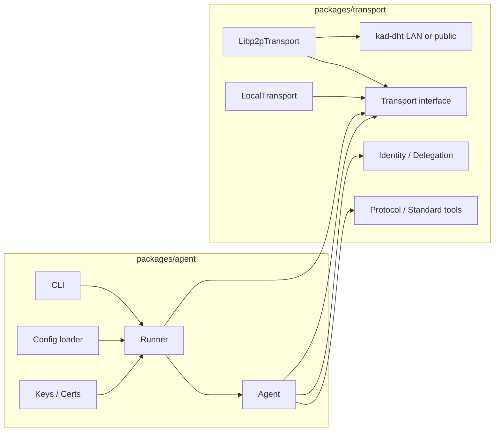

# AgentMesh: POC to Production Plan

## Current state (from [docs/IMPLEMENTATION_PLAN.md](docs/IMPLEMENTATION_PLAN.md) and codebase)

- Single package with: identity (ed25519, delegation), protocol (TaskEnvelope/TaskResponse, canonical JSON, tools), transport interface + `LocalTransport` + `Libp2pTransport` (bootstrap-only, no DHT), and `Agent` that wires them.
- Protocol: `TaskEnvelope` has `tool: string`, `payload: unknown` (free-form). Tools are name + description + optional `parameters`; no standard tool definitions.
- Discovery: bootstrap list + direct tool advertisement over streams; DHT was planned but not implemented (see comment in [src/transport/libp2p.ts](src/transport/libp2p.ts) line 25).

---

## 1. Monorepo layout: transport package + agent package

**Goal:** Current code becomes the transport-layer package; a second package is the runnable agent (config, keys, commands, skills, prompts, tools).

**Structure:**

- **Root:** pnpm workspace (`pnpm-workspace.yaml`), shared TypeScript/ESLint/Prettier, root `package.json` with workspace scripts (`build`, `test`, `lint`).
- `**packages/transport` (e.g. `@agentmesh/transport`):
  - Move existing code here: identity ([src/identity/](src/identity/)), protocol ([src/protocol/](src/protocol/)), transport adapters ([src/transport/](src/transport/)), and [src/agent.ts](src/agent.ts).
  - This package exposes: transport interface, `LocalTransport`, `Libp2pTransport`, `Agent`, protocol types and helpers, identity and delegation. No CLI, no file-based config.
- `**packages/agent` (e.g. `@agentmesh/agent` or `agentmesh-agent`):
  - Depends on `@agentmesh/transport`.
  - Runnable entrypoint (e.g. `agent start` or `npx agentmesh-agent start`) that:
    - Loads config (file-based: config path or default `./agentmesh.config.`).
    - Loads or generates **signing keys** (agent + optional owner for delegation); keys and certs stored in a designated dir (e.g. `~/.agentmesh` or `./.agentmesh`).
    - Registers **tools** (from config and/or plugins).
    - Applies **skills**, **prompts**, and **commands** (definitions live in config or linked files).
    - Creates transport (Libp2pTransport with options from config), creates Agent, registers tools, starts agent.
  - Config shape: transport options (LAN vs public, bootstrap, listen port), keys path, tools/skills/prompts/commands definitions, and any agent metadata.

**Migration steps:**

- Add `pnpm-workspace.yaml` and move current `package.json` content into `packages/transport`, fix imports and `main`/exports.
- Create `packages/agent` with dependency on `@agentmesh/transport`, add minimal CLI (e.g. `start`), config loading, key handling, and wiring to `Agent` + `Libp2pTransport`.
- Root scripts: `pnpm -r build`, `pnpm -r test`, etc. Keep existing tests in `packages/transport` and add tests for the agent package where appropriate.

---

## 2. Protocol: clamp to specific fields + standard free-text tool for LLM agents

**Goal:** Move from a single free-form `payload: unknown` to a protocol where payloads align with pre-specified tool definitions, and add a first-class **free-text tool** for LLM-to-LLM communication.

**Approach:**

- **Standard tool definition for free text:**
  - Define a well-known tool (e.g. name `agentmesh/llm-message` or `agentmesh/free-text`) with a single parameter: `text` (string).
  - Schema example: `{ name: "agentmesh/llm-message", description: "Free-form text message for LLM agents", parameters: { type: "object", required: ["text"], properties: { text: { type: "string" } } } }`.
  - This becomes the standard way for LLM agents to send arbitrary text to each other; all other tools can remain custom with their own schemas.
- **Clamping the protocol:**
  - **Option A (recommended):** Keep `TaskEnvelope.payload` as typed by tool: for the standard free-text tool, payload is `{ text: string }`; for other tools, payload is validated against each tool’s `parameters` (JSON Schema) when the tool is registered. So the protocol “clamps” by: (1) defining standard tools in the codebase/spec, (2) validating payload per tool at send/accept time.
  - **Option B:** Replace `payload: unknown` with a discriminated union (e.g. `payload: LlmMessagePayload | CustomToolPayload`) and a fixed set of tool names in the spec; more breaking and less flexible.
  - Implement in **transport package**: add a small **protocol** module (e.g. `packages/transport/src/protocol/standard-tools.ts`) that exports the free-text tool definition and a validator helper. Agent package (and any consumer) can validate payloads against tool schema before sending and when receiving.
- **Concrete steps:**
  - Add `STANDARD_TOOLS` (or similar) in transport package with at least `agentmesh/llm-message` (name, description, parameters schema).
  - Add optional payload validation in `Agent.request` and in the task handler path (validate `envelope.payload` against the registered tool’s schema); invalid payload → error response.
  - Document the free-text tool in the protocol spec (e.g. in IMPLEMENTATION_PLAN or a PROTOCOL.md) so other implementations can align.

---

## 3. Re-add kad-dht; LAN mode vs public internet mode

**Goal:** Use `@libp2p/kad-dht` for discovery and support two modes: **LAN** (agents only discover/talk to peers on the same LAN) and **public** (full internet DHT). LAN agents must not discover or connect to public-only agents.

**Mechanics (libp2p JS):**

- **Public DHT:** Use `@libp2p/kad-dht` with default protocol (e.g. `/ipfs/kad/1.0.0`) and public bootstrap list (e.g. IPFS bootstrap nodes or your own).
- **LAN DHT:** Use kad-dht with LAN protocol and peer mapping that excludes public addresses, so only LAN-reachable peers are used (see e.g. [IPFS LAN DHT](https://discuss.ipfs.tech/t/questions-on-ipfs-lan-dht-and-local-peer-discovery/10099) and `removePublicAddressesMapper` / protocol `/ipfs/lan/kad/1.0.0`).

**Design:**

- **Transport option:** Add to `Libp2pTransportOptions` (or config that feeds it) a `network: 'lan' | 'public'` (or `mode: 'lan' | 'public'`).
- **LAN:**
  - Configure kad-dht with LAN protocol and peer-info mapper that removes public addresses; bootstrap only to LAN peers (or mDNS / local discovery) so the DHT only contains LAN peers.
  - Listen on a local bind (e.g. `0.0.0.0` or `127.0.0.1` for tests).
- **Public:**
  - Configure kad-dht with default (public) protocol and public bootstrap list.
  - Optionally keep bootstrap list configurable for private/public hybrid.

**Tool advertisement and discovery:**

- Today tools are advertised over a custom stream to connected peers. With DHT:
  - **Publish:** For each advertised tool name (and optionally owner/fleet key), put a DHT record (e.g. provider or key/value) so that `discover(toolName)` can resolve to peer IDs via DHT.
  - **Discover:** `discover(toolName)` uses DHT findProviders or getValue instead of (or in addition to) the current in-memory map of connected peers’ tools.
- Ensure LAN nodes only use the LAN DHT and public nodes only the public DHT, so LAN agents never see public-only peers in discovery results and never dial them (strict separation).

**Implementation steps:**

- Add dependency `@libp2p/kad-dht` in `packages/transport`.
- In `Libp2pTransport`, conditionally add kad-dht service:
  - If `network === 'lan'`: use LAN kad-dht config (LAN protocol + removePublicAddressesMapper; clientMode as needed).
  - If `network === 'public'`: use default kad-dht + public bootstrap.
- Replace or complement the current “tool advertisement over stream” with DHT provide/findProviders (and optionally get/put for tool list metadata). Keep backward compatibility with existing stream-based tool exchange for connected peers if desired.
- Document LAN vs public in config and in [docs/IMPLEMENTATION_PLAN.md](docs/IMPLEMENTATION_PLAN.md).

---

## 4. Agent package: runnable agent with config, keys, commands, skills, prompts, tools

**Goal:** A second package that uses the transport package and provides a runnable process: start an agent with configuration, keys, and capabilities (commands, skills, prompts, tools).

**Scope:**

- **Config:**
  - File-based (e.g. `agentmesh.config.json` / `.ts` / `.yaml`).
  - Contents: transport type and options (listen port, `network: 'lan' | 'public'`, bootstrap addrs), agent display name/id (optional), paths for keys and data dir.
  - Optional: paths to or inline definitions for tools, skills, prompts, commands.
- **Keys and security:**
  - **Agent keypair:** Path for agent ed25519 key (e.g. `keys/agent.key` under data dir); generate if missing.
  - **Owner keypair (optional):** For delegation; path e.g. `keys/owner.key`.
  - **Delegation cert:** If owner is configured, create or load delegation cert (scope, TTL) and pass to `Agent`.
  - All under a single “data dir” (e.g. `~/.agentmesh` or `./.agentmesh`) so keys and certs live in one place.
- **Tools:**
  - Config lists tools (name, description, parameters schema) and how to run them (e.g. local handler module path or built-in handler name).
  - Built-in registration of the standard free-text tool `agentmesh/llm-message` so every runnable agent can receive LLM messages.
  - Other tools registered from config or plugins (files that export tool def + handler).
- **Commands, skills, prompts:**
  - **Commands:** CLI subcommands or config-defined actions (e.g. “run this tool”, “send this prompt”). Definitions in config or linked files.
  - **Skills:** Named capabilities (e.g. “summarize”, “translate”); map to tools or to internal logic; config or file.
  - **Prompts:** Templates or named prompts the agent can use when processing requests; stored in config or in a prompts directory.
  - These live in the agent package only; the transport package stays agnostic (it only knows “tools” and task envelopes).
- **Entrypoint:**
  - CLI: e.g. `agent start`, `agent init` (scaffold config + keys), `agent keys show` (show agent ID / multiaddr).
  - Single long-running process: load config → load/generate keys → create transport (LAN or public from config) → create Agent → register tools (including standard free-text) and optionally wire skills/prompts/commands → start agent → keep process alive.

**File layout (suggested):**

- `packages/agent/package.json` (bin entry, depends on `@agentmesh/transport`).
- `packages/agent/src/cli.ts` (argument parsing, dispatch to `start` / `init` / etc.).
- `packages/agent/src/runner.ts` or `start.ts` (load config, keys, create transport + Agent, register tools, start).
- `packages/agent/src/config.ts` (config schema and loading from file).
- `packages/agent/src/keys.ts` (load/save agent and owner keys, delegation cert; under data dir).
- Optional: `packages/agent/src/commands/`, `skills/`, `prompts/` for default or example definitions.

**Dependencies:**

- Transport package for `Agent`, `Libp2pTransport`, protocol, identity.
- Config loader (e.g. `cosmiconfig` or simple `readFile` + JSON.parse).
- CLI parser (e.g. `commander` or `yargs`).
- No direct libp2p in agent package; all networking via transport package.

---

## 5. Order of work and testing

- **Phase 1 – Monorepo + transport package:** Create workspace, move code to `packages/transport`, fix exports and tests. No behavior change.
- **Phase 2 – Protocol + standard free-text tool:** Add standard tool definition and optional payload validation in transport package; document.
- **Phase 3 – kad-dht + LAN/public:** Add `@libp2p/kad-dht`, implement `network: 'lan' | 'public'` in Libp2pTransport, wire discovery to DHT; document and test both modes.
- **Phase 4 – Agent package:** Create `packages/agent` with config, keys, CLI, tool registration (including free-text), and start flow using transport package; add commands/skills/prompts layout.

Testing: keep and run existing tests in `packages/transport`; add integration tests for LAN vs public (e.g. two nodes in LAN mode discover each other; no cross-mode discovery). Agent package: unit tests for config loading and key handling; optional E2E for `agent start` with LocalTransport or in-memory transport.

---

## 6. Diagram (high-level)

This plan leaves the transport package as the single place for protocol, identity, and transport abstractions, and the agent package as the only place for “how to run an agent in the real world” (config, keys, commands, skills, prompts, tools).
